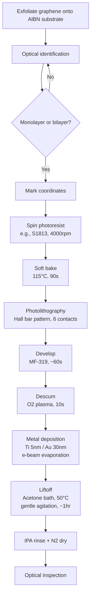

# Graphene Hall Bar Contacts - Ti/Au on AlBN Substrate

**Base Recipe**: [ti-au-standard.md](../../recipes/graphene-contacts/ti-au-standard.md)

**Substrate Modification**: Using AlBN instead of Si/SiO2

## Process Flow

## Substrate-Specific Considerations

### AlBN vs SiO2 Differences:
1. **Optical contrast**: Different from standard SiO2 - may need adjusted lighting/filters
2. **Surface properties**: AlBN may have different wetting/adhesion characteristics
3. **Charging**: Consider conductivity differences during e-beam deposition

### Potential Process Adjustments:
- Monitor photoresist adhesion on AlBN
- Check if Ti adhesion layer thickness needs adjustment
- Verify liftoff characteristics on AlBN surface

## Detailed Steps

[Same steps as base recipe - see linked recipe above]

## Process Log

### Pre-fabrication:
- Date started: 
- Substrate batch: 
- Graphene source: 
- Flake ID: 

### Deviations from base recipe:
- [ ] None
- [ ] (Document any changes here)

### Process notes:
(Add observations during fabrication)

## Results

### Device Characteristics:
- Contact resistance: 
- Two-terminal resistance: 
- Gate response: 

### Images:
- See `images/` directory

### Data:
- See `data/` directory

## GDS Files

Pattern used: `gds/hallbar-6contact.gds` (add your file here)
