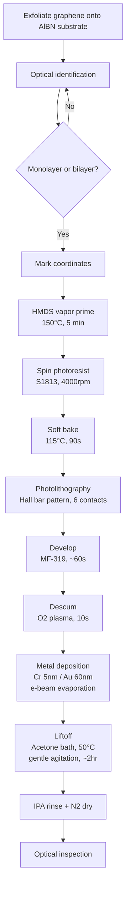

# Graphene Hall Bar Contacts - Cr/Au on AlBN Substrate

**Base Recipe**: [ti-au-standard.md](../../recipes/graphene-contacts/ti-au-standard.md)

**Modifications from Base Recipe**:
1. **Substrate**: AlBN instead of Si/SiO2
2. **Metal stack**: Cr 5nm / Au 60nm (instead of Ti 5nm / Au 30nm)

## Process Flow

## Substrate-Specific Considerations

### AlBN vs SiO2 Differences:
1. **Optical contrast**: Different from standard SiO2 - may need adjusted lighting/filters
2. **Surface properties**: AlBN may have different wetting/adhesion characteristics
3. **Charging**: Consider conductivity differences during e-beam deposition
4. **HMDS treatment**: May be more critical on AlBN for resist adhesion

### Cr/Au vs Ti/Au Differences:
1. **Adhesion layer work function**: Cr has different electronic properties than Ti
2. **Oxidation susceptibility**: Cr more prone to oxidation - handle samples carefully
3. **Thicker Au layer**: 60nm vs 30nm - may affect liftoff difficulty
4. **Deposition rates**: Cr may have different optimal deposition rate than Ti

### Potential Process Adjustments:
- Add HMDS prime before resist spin
- Monitor Cr adhesion on AlBN surface
- Verify liftoff characteristics with thicker Au (may need longer soak time)
- Check for Cr oxidation during storage

## Detailed Steps

### 1. Graphene Exfoliation
- Method: Scotch tape mechanical exfoliation
- Substrate: AlBN
- Target: Monolayer or bilayer graphene
- **Note**: Optical contrast will differ from Si/SiO2

### 2. Optical Identification
- Use optical microscope with appropriate filters
- Identify candidate flakes based on contrast
- **AlBN-specific**: Adjust illumination/filters for optimal contrast
- Confirm thickness with Raman spectroscopy if needed
- Record coordinates for photolithography alignment

### 3. HMDS Vapor Prime
- **Added step for AlBN substrate**
- Equipment: YES HMDS Oven
- Temperature: 150°C
- Time: 5 minutes
- Purpose: Improve resist adhesion on AlBN surface

### 4. Photoresist Spin Coating
- Resist: Shipley S1813 (positive photoresist)
- Spin speed: 4000 rpm, 45 seconds
- Target thickness: ~1.3 μm
- **Note**: Watch for adhesion on AlBN

### 5. Soft Bake
- Temperature: 115°C
- Time: 90 seconds
- Hotplate

### 6. Photolithography
- Pattern: Hall bar geometry with 6 contacts
- Exposure: Contact aligner, appropriate dose for resist
- Alignment: Use pre-marked coordinates or alignment marks
- **Expected**: Similar exposure as on SiO2, verify first device

### 7. Development
- Developer: MF-319 or equivalent
- Time: ~60 seconds
- Rinse: DI water
- N2 dry
- **Check**: Complete development, no residue in contact areas

### 8. Descum
- O2 plasma clean
- Power: Low (e.g., 50W)
- Time: 10 seconds
- Purpose: Remove residual resist in contact areas

### 9. Metal Deposition
- Method: E-beam evaporation
- **Layer 1**: Cr, 5 nm (adhesion layer)
  - Deposition rate: 0.5-1.0 Å/s
  - Watch for rate stability
- **Layer 2**: Au, 60 nm (contact metal) - **2× thicker than standard**
  - Deposition rate: 1.0-2.0 Å/s
  - Extended deposition time vs standard recipe
- Base pressure: <5×10⁻⁶ Torr
- **Critical**: Monitor Cr adhesion to AlBN

### 10. Liftoff
- Solvent: Acetone
- Temperature: 50°C
- Method: Immerse in warm acetone bath
- Agitation: Gentle (no sonication - can damage graphene)
- Time: ~2 hours or until metal lifts off - **Extended time due to thicker Au**
- Check periodically under microscope
- **Watch for**: More difficult liftoff due to 60nm Au thickness

### 11. Rinse and Dry
- Rinse: Isopropanol (IPA)
- Dry: N2 gun
- Inspect under optical microscope

### 12. Inspection
- Check contact quality under optical microscope
- Verify no resist residue
- Check for shorts between contacts
- Look for Cr oxidation (discoloration)
- Optional: Initial resistance measurement

## Notes and Variations

### Cr/Au Specific Considerations:
- **Cr oxidation**: More susceptible than Ti - minimize air exposure
- **Work function**: Cr (~4.5 eV) vs Ti (~4.3 eV) may affect contact properties
- **Adhesion**: Cr adhesion to AlBN not previously characterized in our lab

### Thicker Au Considerations:
- **Liftoff time**: May need 2× longer soak in acetone
- **Metal stress**: Thicker films may have different stress, watch for delamination
- **Contact resistance**: Thicker Au should reduce bulk resistance contribution

### Alternative approaches if issues arise:
- **Poor liftoff**: Increase resist thickness to 1.6 μm (3000 rpm spin)
- **Cr adhesion issues**: Try brief O2 plasma treatment of AlBN before deposition
- **Cr oxidation**: Store in vacuum or inert atmosphere immediately after fabrication

## Expected Results

- Contact resistance: Target <500 Ω·μm (improved vs Ti/Au due to thicker Au)
- Success rate: Unknown - first Cr/Au attempt on AlBN
- Device yield: Depends on liftoff success with thicker metal

## Comparison Metrics

Track these for comparison with Ti/Au device (2025-01-10):
- Contact resistance (2-terminal and 4-terminal)
- Liftoff quality and yield
- Optical appearance of contacts
- Long-term stability (Cr oxidation vs time)

## Troubleshooting

- **Poor liftoff with thick Au**: Increase acetone soak time, try 60°C
- **High contact resistance**: May indicate Cr oxidation or poor Cr-AlBN adhesion
- **Resist residue**: Increase development time or use oxygen plasma clean after liftoff
- **Cr oxidation**: Handle in N2 environment, measure contacts quickly after fabrication

## Process Log

### Pre-fabrication:
- Date started: 2025-01-11
- Substrate batch: 
- Graphene source: 
- Flake ID: 

### Deviations from base recipe:
- [X] Metal stack: Cr/Au instead of Ti/Au
- [X] Au thickness: 60nm instead of 30nm
- [X] Substrate: AlBN instead of Si/SiO2
- [X] Added HMDS prime
- [ ] (Document any additional changes here)

### Process notes during fabrication:
(Add observations as you go)

## Results

### Device Characteristics:
- Contact resistance: 
- Two-terminal resistance: 
- Gate response: 
- Comparison with Ti/Au device: 

### Images:
- See `images/` directory

### Data:
- See `data/` directory

## GDS Files

Pattern used: `gds/hallbar-6contact.gds` (same as Ti/Au device)

### Layout Previews

(GDS files will be added here)
