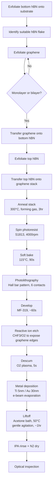

# Graphene Hall Bar Contacts - Ti/Au with hBN Encapsulation

## Process Flow

## Detailed Steps

### 1. Bottom hBN Exfoliation
- Method: Scotch tape mechanical exfoliation
- Substrate: Si/SiO2 (typically 285nm or 90nm oxide)
- Target: Flat, clean hBN flake, thickness 10-30 nm
- Inspect for bubbles, wrinkles, contamination

### 2. Graphene Exfoliation
- Exfoliate onto different substrate or PDMS
- Identify monolayer or bilayer graphene
- Confirm with optical contrast and/or Raman

### 3. Graphene Transfer
- Method: Dry transfer (PDMS stamp or PC film)
- Align graphene onto center of bottom hBN
- Temperature: Room temp or slightly elevated (~40°C)
- Minimize polymer residue

### 4. Top hBN Exfoliation and Transfer
- Exfoliate top hBN (similar thickness to bottom)
- Transfer to fully cover graphene
- Critical: Ensure good coverage over contact regions

### 5. Stack Annealing
- Temperature: 300°C
- Atmosphere: Forming gas (95% N2, 5% H2) or Ar/H2
- Time: 3 hours
- Purpose: Improve interfaces, remove contaminants
- Cool slowly to room temperature

### 6. Photoresist Spin Coating
- Resist: Shipley S1813
- Spin: 4000 rpm, 45 seconds
- Thickness: ~1.3 μm

### 7. Soft Bake
- Temperature: 115°C
- Time: 90 seconds

### 8. Photolithography
- Pattern: Hall bar with 6 contacts
- Must extend into hBN to reach graphene edges
- Standard contact aligner exposure

### 9. Development
- Developer: MF-319
- Time: ~60 seconds
- DI water rinse, N2 dry

### 10. Reactive Ion Etch (RIE)
- **Critical step**: Etch through top hBN to expose graphene edges
- Gas: CHF3/O2 mixture (typical ratio 40:4 sccm)
- Power: 50-100W
- Time: Calibrate based on hBN thickness (~30-60 seconds for 20nm hBN)
- Endpoint: Stop before etching into graphene significantly
- Over-etch slightly to ensure full hBN removal in contact area

### 11. Descum
- O2 plasma, very brief
- Power: 50W
- Time: 5 seconds (shorter than non-encapsulated due to exposed graphene edge)

### 12. Metal Deposition
- Method: E-beam evaporation
- Ti: 5 nm (adhesion to hBN and graphene edge)
- Au: 30 nm
- Base pressure: <5×10⁻⁶ Torr
- Rate: 0.5-1.0 Å/s

### 13. Liftoff
- Acetone bath, 50°C
- Gentle agitation, no sonication
- Time: ~1 hour
- Monitor progress

### 14. Final Rinse and Inspection
- IPA rinse
- N2 dry
- Optical inspection
- Resistance check

## Key Differences from Non-Encapsulated Recipe

1. **Transfer steps**: Requires building hBN/graphene/hBN stack before patterning
2. **RIE etch**: Essential to expose graphene edges through top hBN
3. **Annealing**: Stack annealing improves interface quality
4. **Contact geometry**: Contacts made to graphene edges, not top surface
5. **Shorter descum**: Exposed graphene edge is more sensitive

## Notes and Variations

- **Transfer method**: PDMS stamp or PC film - choose based on lab capabilities
- **Alignment precision**: Better alignment = smaller contact resistance
- **RIE chemistry**: Some groups use Ar plasma instead of CHF3/O2
- **Edge contacts only**: This recipe creates edge contacts; top contacts require via etching
- **Stack quality**: Critical for low contact resistance - minimize bubbles and contamination

## Expected Results

- Contact resistance: 100-500 Ω·μm (better than non-encapsulated due to cleaner interfaces)
- Device quality: Higher mobility due to hBN encapsulation
- Success rate: ~60-70% (lower than non-encapsulated due to complexity)

## Troubleshooting

- **High contact resistance**: 
  - Check RIE etch depth - may not have fully removed top hBN
  - Verify descum removes resist residue at edge
  - Consider post-contact annealing
- **Damaged graphene**: Reduce RIE time or power
- **Poor encapsulation**: Bubbles or wrinkles in hBN - improve transfer technique
- **Metal adhesion issues**: Ti layer may need optimization for hBN surface
