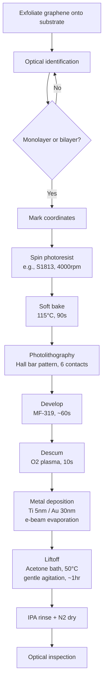

# Graphene Hall Bar Contacts - Ti/Au Standard

## Process Flow

## Detailed Steps

### 1. Graphene Exfoliation
- Method: Scotch tape mechanical exfoliation
- Substrate: Si/SiO2 (typically 285nm or 90nm oxide)
- Target: Monolayer or bilayer graphene

### 2. Optical Identification
- Use optical microscope with appropriate filters
- Identify candidate flakes based on contrast
- Confirm thickness with Raman spectroscopy if needed
- Record coordinates for photolithography alignment

### 3. Photoresist Spin Coating
- Resist: Shipley S1813 (positive photoresist)
- Spin speed: 4000 rpm, 45 seconds
- Target thickness: ~1.3 μm

### 4. Soft Bake
- Temperature: 115°C
- Time: 90 seconds
- Hotplate

### 5. Photolithography
- Pattern: Hall bar geometry with 6 contacts
- Exposure: Contact aligner, appropriate dose for resist
- Alignment: Use pre-marked coordinates or alignment marks

### 6. Development
- Developer: MF-319 or equivalent
- Time: ~60 seconds
- Rinse: DI water
- N2 dry

### 7. Descum
- O2 plasma clean
- Power: Low (e.g., 50W)
- Time: 10 seconds
- Purpose: Remove residual resist in contact areas

### 8. Metal Deposition
- Method: E-beam evaporation
- Layer 1: Ti, 5 nm (adhesion layer)
- Layer 2: Au, 30 nm (contact metal)
- Base pressure: <5×10⁻⁶ Torr
- Deposition rate: 0.5-1.0 Å/s

### 9. Liftoff
- Solvent: Acetone
- Temperature: 50°C
- Method: Immerse in warm acetone bath
- Agitation: Gentle (no sonication - can damage graphene)
- Time: ~1 hour or until metal lifts off
- Check periodically under microscope

### 10. Rinse and Dry
- Rinse: Isopropanol (IPA)
- Dry: N2 gun
- Inspect under optical microscope

### 11. Inspection
- Check contact quality under optical microscope
- Verify no resist residue
- Check for shorts between contacts
- Optional: Initial resistance measurement

## Notes and Variations

- **Alternative resist**: AZ5214E for image reversal
- **Metal stack variations**: Some groups use Cr/Au (5nm/50nm) instead
- **No descum option**: Skip O2 plasma if concerned about doping effects
- **Contact resistance**: Can be improved with annealing (300°C, forming gas)

## Expected Results

- Contact resistance: Typically 500-2000 Ω·μm for this method
- Success rate: >80% for clean exfoliated graphene
- Device yield: Depends on flake quality and process control

## Troubleshooting

- **Poor liftoff**: Increase resist thickness or use harder bake
- **High contact resistance**: Try descum or contact annealing
- **Resist residue**: Increase development time or use oxygen plasma clean after liftoff
